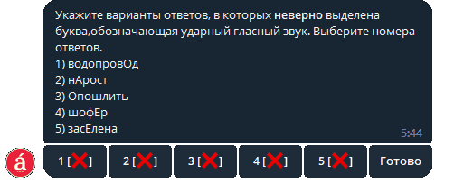
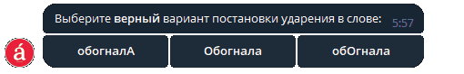

# Accents

Телеграм бот для школьников, позволяющий в удобной форме готовиться к экзамену по русскому. В нём можно тренироваться в корректном постановлении ударений в словах. Бот использует данные из словаря ударений ФИПИ для генерации разнообразных тестов и заданий.

Проект был создан на основе фреймворка aiogram. Aiogram позволяет отправлять и получать данные асинхронно, что в свою очередь позволяет боту работать с несколькими клиентами одновременно.

Для хранения данных был использован фреймворк Sqlalchemy, который позволяет обращаться к базам данных используя объектно-реляционное отображение.

При создании проекта также были использованы такие библиотеки как: loguru (логирование), configparser (файлы конфигураций) и некоторые другие небольшие модули.

## Генерация заданий ЕГЭ

## Генерация тестов по ударениям

## Стэк разработки 💻

- **Языки:**
  - Python 3.10
- **Telegram:**
  - [Aiogram](https://docs.aiogram.dev/en/latest/)
- **База данных:**
  - [Sqlalchemy](https://docs.sqlalchemy.org/en/14/)
- **Логирование:**
  - [Loguru](https://loguru.readthedocs.io/en/stable/index.html/)
